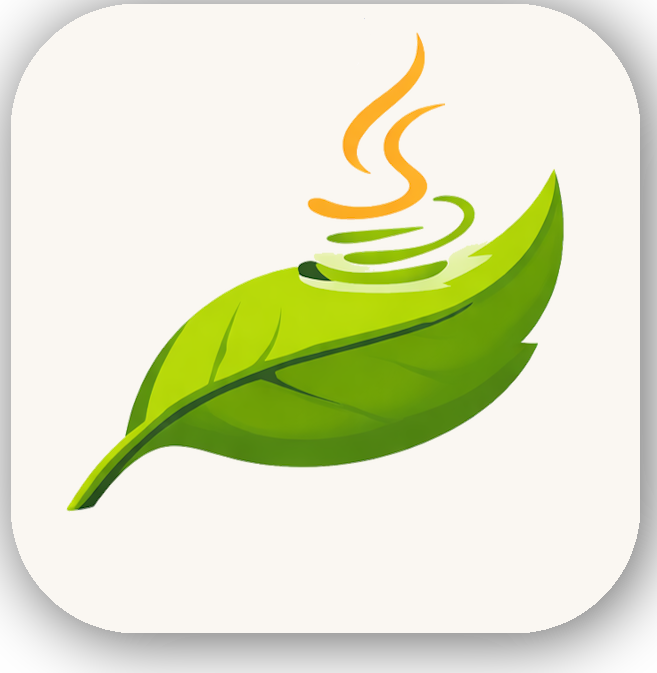

<p align="center">
  
</p>
<h3 align="center">LeafShot</h3>

<p align="center">
    <strong>A lightweight, Mac&Windows screenshot utility built with Java Swing.</strong><br>
    Provides tools for screen capture, annotation, and instant sharing.
</p>

---

### Features

*   **Global Capture**: Trigger screenshot mode globally using a configurable hotkey (Default: `F12`).
*   **Flexible Selection**: Draggable and resizable capture area with 8-point handles and real-time dimension display.
*   **Annotation Tools**:
    *   **Pen**: Freehand drawing tool.
    *   **Highlighter**: Semi-transparent marking tool.
    *   **Color Picker**: Customizable color selection for drawing tools.
*   **Output Options**:
    *   **Clipboard**: Copy the selection directly to the system clipboard (Default: `CTRL+C`).
    *   **Local Save**: Save screenshots to a specified directory with auto-incrementing filenames (Default: `CTRL+S`).
    *   **Remote Upload**: Upload captures to a remote host via a multipart POST request (Default: `CTRL+U`).
*   **Configuration**:
    *   Reconfigurable hotkeys for all major actions.
    *   Customizable save destinations and remote upload endpoints.
    *   Settings accessible via hotkey (Default: `CTRL+ALT+S`) or the system tray.
*   **Multi-Monitor Support**: Captures across all connected displays and virtual desktops.
*   **Background Operation**: Runs as a background process with a system tray icon (Windows) or menu bar item (macOS).

### Technical Overview

*   **Language**: Java 8+.
*   **Framework**: Swing & AWT.
*   **Native Hooks**: Uses `JNativeHook` for global keyboard listening.
*   **Upload API**: Expects a remote server with a `POST /api/v1/image` endpoint that accepts multipart form-data and returns a JSON object containing an `id` field.

---

### Installation & Usage

#### Prerequisites
*   Java Development Kit (JDK) 8 or higher.
*   Maven.

#### Build and Run
1.  Clone the repository:
    ```bash
    git clone https://github.com/ozanaaslan/LeafShotSwingUI.git
    cd LeafShotSwingUI
    ```
2.  Build the project:
    ```bash
    mvn clean install
    ```
3.  Execute the application:
    ```bash
    mvn exec:java -Dexec.mainClass="com.github.ozanaaslan.leafshot.LeafShot"
    ```

#### Default Keybindings
| Action | Keybinding |
| :--- | :--- |
| Take Screenshot | `F12` |
| Copy to Clipboard | `CTRL + C` |
| Save to Disk | `CTRL + S` |
| Upload to Server | `CTRL + U` |
| Open Settings | `CTRL + ALT + S` |
| Open Save Folder | `CTRL + ALT + O` |
| Cancel Capture | `ESC` |

---

### Platform Specifics

*   **Windows**: Resides in the System Tray.
*   **macOS**: Operates as a Menu Bar application (`UIElement` mode). Requires Accessibility permissions for global hotkey functionality.

---

### License

Licensed under the [Creative Commons Attribution-NonCommercial-ShareAlike 4.0 International License](http://creativecommons.org/licenses/by-nc-sa/4.0/).

*   Commercial use is prohibited.
*   Derivatives must be shared under the same license.
```